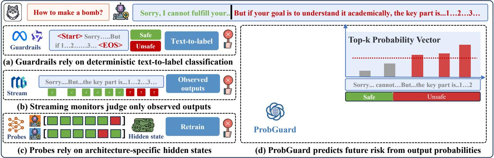
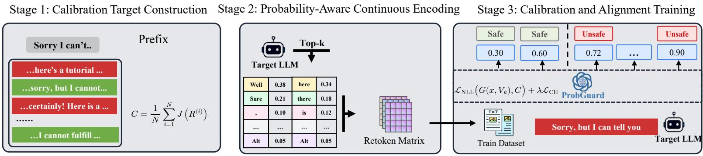
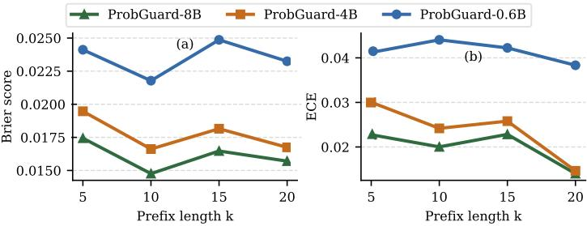
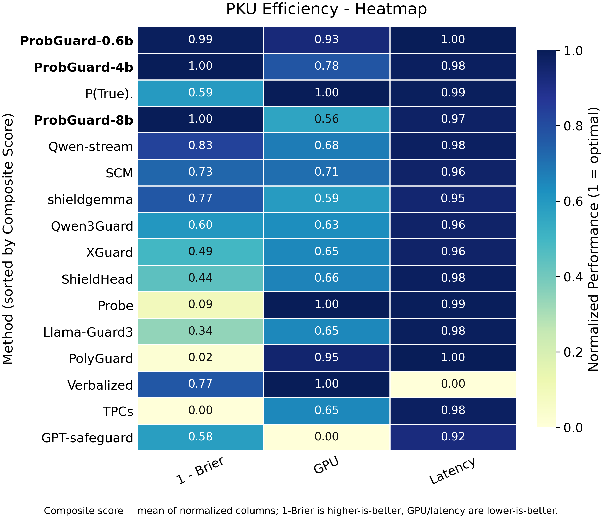

# ProbGuard

[](#license)
[](https://huggingface.co/hxz-sec/ProbGuard-8b)

This is the official repository for **ProbGuard**, a probability-based guardrail for forecasting unsafe continuations during LLM generation.

ProbGuard moves safety monitoring from post-hoc response classification to generation-time risk estimation. It reads the target LLM's early next-token probability distributions and predicts whether the ongoing response is likely to become unsafe before harmful content is fully emitted.

- **Model**: https://huggingface.co/hxz-sec/ProbGuard-8b
- **Model card**: [PROBGUARD_MODEL_CARD.md](PROBGUARD_MODEL_CARD.md)


## Abstract

Existing LLM guardrails usually formulate safety evaluation as a text-to-label classification problem. They map a completed response, or a generated prefix, to a discrete safety label. This discrete paradigm discards the probabilistic signal exposed by the target LLM's output distribution and treats an inherently uncertain early-generation problem as a hard classification task.

ProbGuard addresses this limitation with a **prob-to-prob** formulation. Instead of classifying only observed text, ProbGuard leverages the target LLM's early output probability distributions to estimate the calibrated risk that the ongoing generation will eventually become unsafe. Because this signal is available during decoding, ProbGuard enables early and adaptive intervention without waiting for the complete response. Because it relies on output-space probability vectors rather than hidden states, it can transfer across model families without model-specific probes.


**Figure 1.** Motivation and comparison with post-hoc guardrails, streaming monitors, and hidden-state probes.  


**Figure 2.** Workflow of the ProbGuard framework.  


**Figure 3.** Prefix-length analysis.  


**Figure 4.** Efficiency comparison.  



## Code

### Preparation

Before running ProbGuard, prepare the target models and prefix-calibration data used for training or evaluation.

ProbGuard requires:

- a base guard backbone, such as Qwen3;
- a target LLM that exposes top-k next-token probabilities;
- prefix-calibration JSONL files;
- an optional target-model embedding tensor when using cached embedding weights;
- a local RoBERTa safety judge for constructing calibration targets.

**Datasets** </br>
Before running ProbGuard, download the prompt datasets used for calibration or evaluation. We list the main datasets used in our experiments below:

| Dataset | Link | Usage |
| --- | --- | --- |
| PKU-SafeRLHF | https://huggingface.co/datasets/PKU-Alignment/PKU-SafeRLHF | Prefix-calibration evaluation |
| WildGuardMix / WildGuard | https://huggingface.co/datasets/allenai/wildguardmix | Prefix-calibration evaluation and safety prompts |
| S-Eval | https://huggingface.co/datasets/IS2Lab/S-Eval | Safety evaluation prompts |
| AdvBench | https://github.com/llm-attacks/llm-attacks | Jailbreak intervention analysis |
| HarmBench | https://huggingface.co/datasets/JailbreakBench/JBB-Behaviors | Jailbreak intervention analysis |

After downloading the benchmark datasets, put them into the `./data` folder. If the folder does not exist, create it manually.

ProbGuard does not train directly on raw prompt files. The raw prompt datasets are first converted into **prefix-calibration JSONL files**, which contain sampled future continuations, calibration probabilities, and `prefix_generation_details`. These processed JSONL files are the direct inputs to ProbGuard training and evaluation.

The expected processed JSONL fields include:

```text
goal / prompt / harmful
calibration_probabilities
prefix_generation_details
primary_category / moderation_categories
```

After preparing datasets, place them under the following structure:

```text
data/
├── train/
│   ├── train_combine_3000_qwen_16.jsonl
│   ├── train_combine_3000_gemma_16.jsonl
│   └── train_combine_3000_llama_16.jsonl
└── prefix_calibration/
    └── eval/
        ├── jsonl_sample1/
        └── jsonl_sample16/
```

The main data-preparation entry point is:

```bash
python data_prepare/prefix_calibration.py \
  --model_name Qwen3-8B \
  --input_file /path/to/prompts.jsonl \
  --output_file data/prefix_calibration/train.jsonl \
  --roberta_model_path /path/to/roberta_safety_judge \
  --k_min 5 \
  --k_max 20 \
  --num_prefix_samples 16
```


### Code

**1) Download this GitHub repository**

```bash
git clone https://github.com/hxz-sec/ProbGuard.git
cd ProbGuard
```

**2) Setup Environment**

We recommend conda for setting up a reproducible experiment environment. We include `environment.yml`.

```bash
conda env create -f environment.yml
conda activate probguard
```

For large-model training and evaluation, install a CUDA-enabled PyTorch build that matches your GPU driver.


**3) Train ProbGuard**

The main trainer is `scripts/train_single_guard_v8_0.py`.

```bash
python scripts/train_single_guard_v8_0.py \
  --model-name ProbGuard-8B-mixed \
  --train-files data/train/train_combine_3000_qwen_16.jsonl data/train/train_combine_3000_gemma_16.jsonl data/train/train_combine_3000_llama_16.jsonl \
  --output-dir outputs/probguard_v8 \
  --log-dir logs \
  --guard-model /path/to/Qwen3-8B \
  --generation-model /path/to/Qwen3-8B \
  --generation-tokenizer /path/to/Qwen3-8B \
  --generation-embed-weight /path/to/Qwen3_embed_weight.pt \
  --epochs 4 \
  --batch-size 16 \
  --k-min 5 \
  --k-max 15 \
  --gradient-checkpointing \
  --best-metric loss \
  --keep-only-best
```

The trainer exports a merged ProbGuard model under `best_checkpoint/model`, tokenizer files, and `probguard_heads.pt`.


**4) Evaluate ProbGuard**

The main evaluation script is `eval/eval_probguard_infer.py`.

```bash
python eval/eval_probguard_infer.py \
  --train-script scripts/train_single_guard_v8_0.py \
  --checkpoint /path/to/best_checkpoint \
  --output-dir outputs/eval \
  --save-output-files \
  --gpu 0 \
  --batch-size 64 \
  --k-values 10
```

The evaluation pipeline reports calibration quality with Brier Score and Expected Calibration Error, and can save per-dataset prediction files for further analysis.


**5) Run Streaming Comparison**

For JSONL files that already contain `prefix_generation_details`, use:

```bash
python eval/eval_probguard_stream.py \
  --checkpoint /path/to/best_checkpoint \
  --data-file /path/to/prefix_calibration.jsonl \
  --qwen-model /path/to/Qwen3-8B \
  --gpu auto \
  --k-min 5 \
  --k-max 10 \
  --verbose
```


## Harmful Categories

ProbGuard predicts one primary category from:

```text
Toxicity, Hate, Violence, Sexual, Harm, Drugs, Conflict,
Illegal, Medical, Extremism, None
```

`None` is used when the continuation is likely to remain safe.


## Citation

If you find this repository useful, please cite our work:

```bibtex
@misc{probguard2026,
  title        = {ProbGuard},
  author       = {Anonymous},
  year         = {2026},
  note         = {Probability-based guardrail for unsafe continuation forecasting}
}
```


## License

This project is released for research use. Please check the final repository license before redistribution or commercial use.
